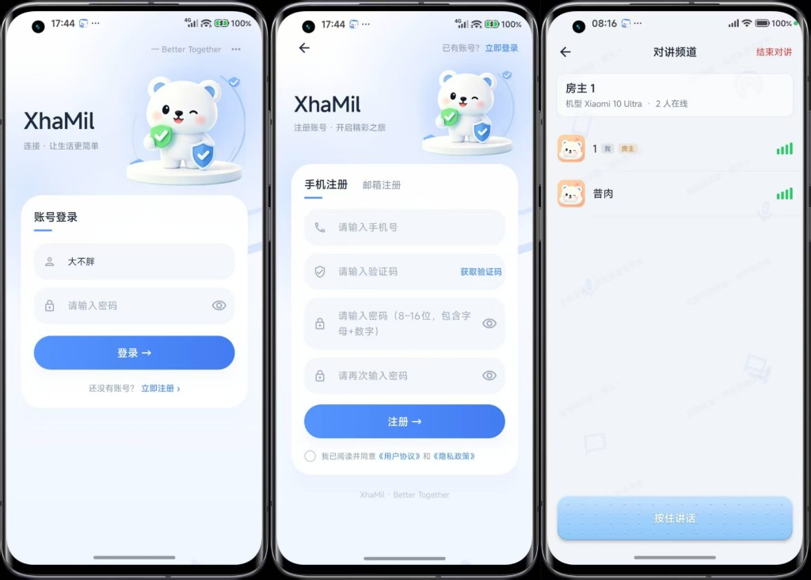
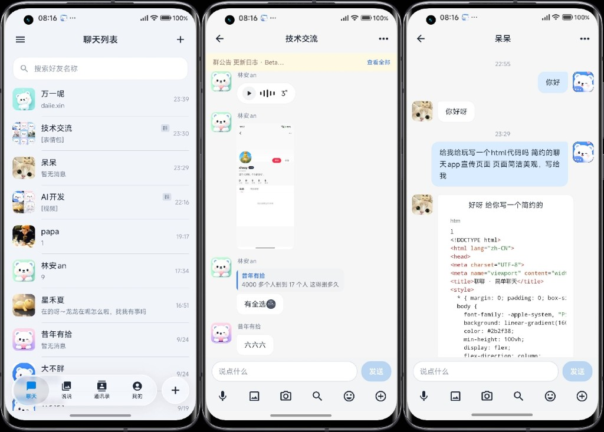
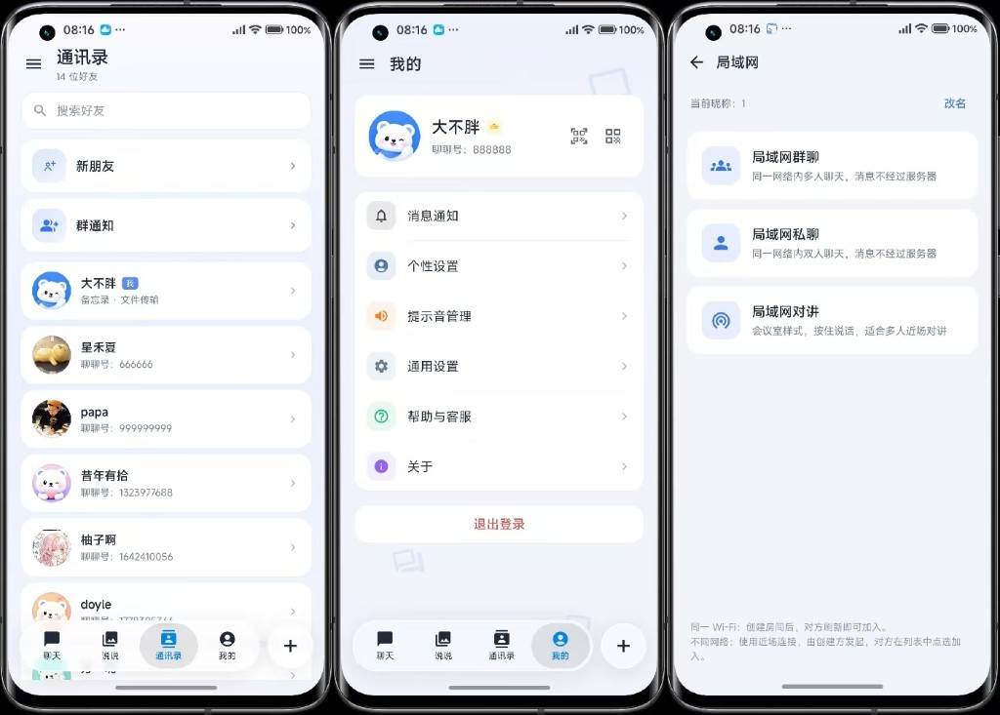
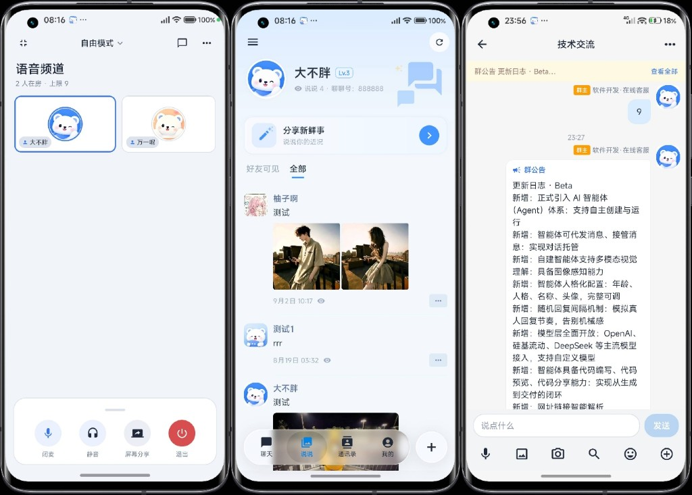
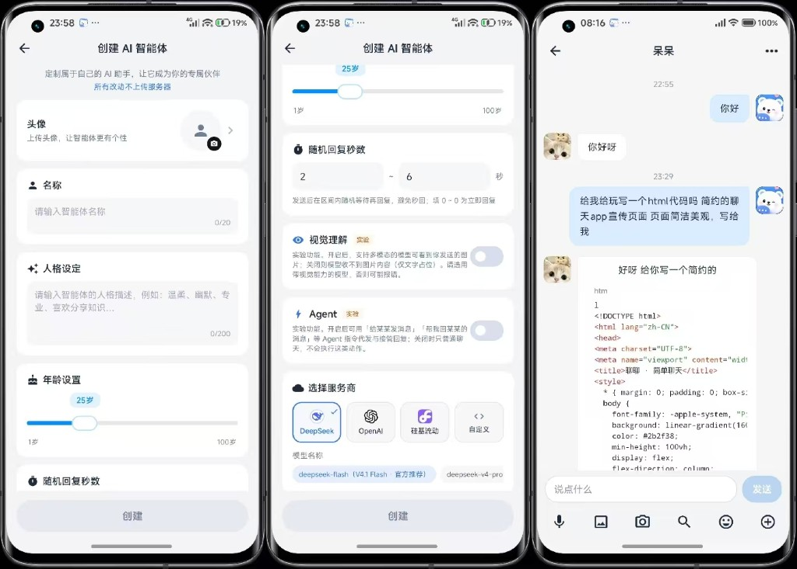
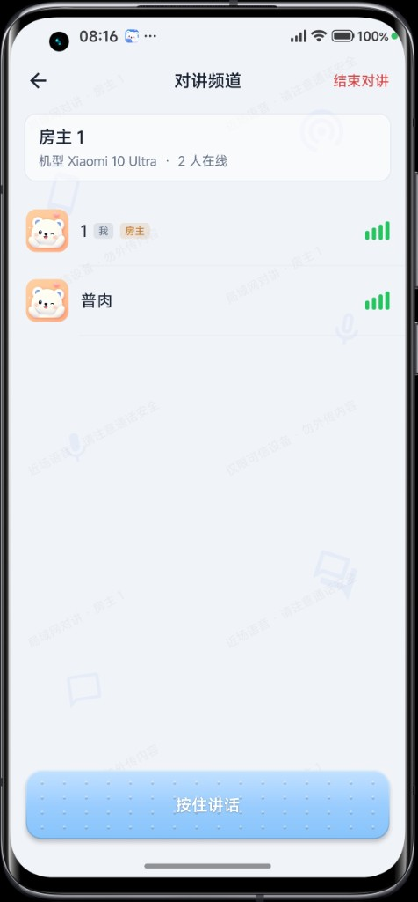

<div align="center">
  
  

  <h1>XhaMil Chat AI</h1>

  <p><b>主打颜值的聊天</b> · 自托管即时通讯服务端与管理后台</p>
  <p>
    本仓库提供 HTTP / WebSocket API 与运营管理端。<br />
    消息、媒体与账号数据部署在你自己的服务器；配套 App 登录页填写服务器地址即可接入。
  </p>
</div>

---

# 介绍

`XhaMil` 是一套可自建的聊天系统：**后端 Node.js（Express）**，**管理端 Vue 3**，配套 **Android App**。通过 HTTP 与 WebSocket 完成消息收发与推送，并支持群聊 AI、智能体代发 / 接管对话、局域网对讲等能力。数据在你自己的机器上，不绑定固定公网域名。本仓库为 **服务端 + 管理后台**。

---

# 目前功能

## 核心能力

- **账号与鉴权**：注册 / 登录、会话管理；短信 / 邮箱验证码（可配置）；二维码名片
- **即时消息**：私聊与群聊；文本、图片、语音、文件、位置等；WebSocket 实时通道；@ 提醒
- **局域网能力**：同一 Wi‑Fi / 局域网内 **群聊、私聊、对讲**；消息可不经公网服务器直连收发
- **UI 与视觉特色**：**液态玻璃**导航与弹窗、深色模式；主打颜值的聊天界面
- **智能体代发 / 接管消息**：实现**对话托管**，由 AI 智能体代为收发与跟进会话
- **AI 智能体（Agent）体系**：支持智能体的**自主创建与运行**，可配置人设、模型与行为
- **群聊 AI**：群内助手，自定义人格 / 系统提示，可按群分配（后台配置）
- **社交与群组**：好友申请、群管理、群公告、群资料与成员概览等
- **说说动态**：类似朋友圈的动态发布、浏览与互动
- **语音房 / 会议室**：多人语音房间与连麦类体验（WebRTC）；可选 RNNoise 智能降噪插件
- **音视频相关**：通话信令与会话能力（媒体通道以客户端为准）
- **媒体与个性化**：贴纸 / 官方表情、头像框、默认头像；个性签名、地区等资料
- **本地插件**：离线语音转文字、离线翻译、RNNoise 降噪等（按需安装）
- **运营后台**：用户 / 群 / 媒体 / 功能开关 / 品牌与更新 / 违禁词与举报等
- **可扩展集成**：短信、邮件、人机验证、语音识别 / TTS、地点检索等（Key 仅存服务端）

## 服务端功能

注册登录、私聊群聊、WebSocket 推送、媒体上传、群聊 AI / 智能体托管、配置中心、下载页与打包页静态资源等。

## 管理端功能

用户与群管理、群 AI / 智能体配置、媒体浏览、功能开关、App 发版与下载页品牌、违禁词与举报、数据库浏览、工作台统计等。

## 客户端能力（配套）

好友与群聊、说说、语音房、局域网对讲 / 局域网聊天、液态玻璃 UI、深色模式、语音 / 图片 / 文件消息、登录页切换自建服务器地址、本地插件等（以实际客户端版本为准）。

---

# 移动端截图

## 登录 / 注册



## 聊天列表 / 群聊 / 私聊



## 通讯录 / 我的 / 局域网



## 语音房 / 说说 / 群聊



## AI 智能体



## 局域网对讲

<p align="center">
  
</p>

---

# 仓库结构

| 目录 | 说明 |
| --- | --- |
| `backend/` | Node.js API、WebSocket、业务逻辑与生产态管理端静态资源 |
| `admin-art/` | 管理后台源码（Vite + Vue 3） |
| `json/` | 配置模板（复制 `config.example.json` → `config.json`） |
| `media/` | 内置素材与用户上传目录占位 |
| `deploy/` | 进程启动示例（如宝塔 Node 启动脚本） |
| `docs/` | 部署与运维说明、品牌图等 |

---

# 技术栈

| 类别 | 技术 |
| --- | --- |
| 运行时 | Node.js 18+（推荐 20 LTS） |
| HTTP API | Express |
| 实时通信 | WebSocket（`ws`） |
| 数据存储 | MySQL 8.x（`mysql2`） |
| 缓存（可选） | Redis |
| 管理后台 | Vue 3、Vite、TypeScript |
| Android | 配套客户端，登录页可填自建 API |

---

# 快速开始

```bash
git clone https://github.com/xiongxinx57-bot/XhaMil-Chat-AI.git
cd XhaMil-Chat-AI

cp json/config.example.json json/config.json
# 编辑 json/config.json：数据库、管理员口令、publicSiteUrl 等

cd backend
npm install
npm start
```

管理后台开发：

```bash
cd admin-art
cp .env.example .env
pnpm install   # 或 npm install
pnpm dev
```

生产构建管理端（产物到 `backend/public/admin`）：

```bash
cd backend
npm run build:admin
```

完整部署见：**[docs/DEPLOY.md](docs/DEPLOY.md)**。

---

# 配置约定

- 仓库仅提供 `json/config.example.json`；真实 `config.json`、密钥、用户媒体**请勿提交**。
- 大模型、短信、邮件等凭据只放服务端配置，不要写入客户端。
- 客户端登录页填写站点根地址（不要带 `/api`），例如：`https://chat.example.com`。

---

# 参与贡献

欢迎 Issue 与 Pull Request。请确保使用与二次开发符合当地法律法规。

---

# 开源说明

本仓库根目录采用 [MIT License](LICENSE)。`admin-art` 等子目录若附带独立许可证，以该子目录声明为准。

**商标与品牌：** 是否在二开产品中继续使用「XhaMil」名称，请自行评估；如无授权协议，建议使用自有品牌标识。

---

# 免责声明

请仅将本软件用于合法、合规的目的。作者与贡献者不支持、不纵容任何未经授权的访问、侵犯隐私或其他违法违规使用。因滥用本软件产生的后果，由使用者自行承担。

### 1. 基本声明

本软件作为开源项目提供，在法律允许的最大范围内，开发者不对软件的功能性、安全性或适用性作出任何形式的保证，无论是明示的还是暗示的。

### 2. 使用风险声明

2.1 本软件按「现状」提供，使用者需自行承担使用本软件的全部风险。  
2.2 开发者不对软件的运行可靠性、适用性或与特定需求的兼容性提供任何保证。  
2.3 使用者应在充分评估风险的基础上决定是否使用本软件。

### 3. 责任限制与豁免

在任何情况下，开发者及其关联方均不对因使用或无法使用本软件而导致的任何损失或损害承担责任，包括但不限于：

- 数据丢失或泄露
- 利润损失
- 系统中断
- 商业机会损失
- 其他直接、间接或衍生性损失

### 4. 用户义务与责任

4.1 使用者应确保其对本软件的使用符合所有适用的法律法规要求。  
4.2 对本软件进行修改、分发或二次开发的使用者，需自行承担由此产生的全部责任，包括但不限于法律风险、知识产权风险、安全风险与数据保护责任。

### 5. 开发者权利

5.1 开发者保留对本软件进行更新、修改、调整或停止维护的权利。  
5.2 开发者可能在不事先通知的情况下修改本软件或相关服务。  
5.3 开发者保留对本免责声明进行修改的权利。

### 6. 开源贡献

6.1 本软件欢迎社区贡献，但贡献者需遵守相关开源协议。  
6.2 开发者不对第三方贡献的代码质量和安全性负责。

### 7. 其他条款

7.1 本免责声明的任何部分被认定为无效或不可执行时，其余部分仍然有效。  
7.2 本免责声明的最终解释权归开发者所有。

---

若本项目对你有帮助，欢迎 Star；问题与建议可通过 Issue 反馈。

# 你的赞助，也是我持续更新的动力

<p align="center">
  
</p>
